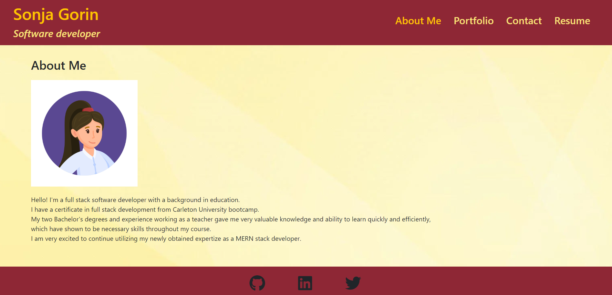
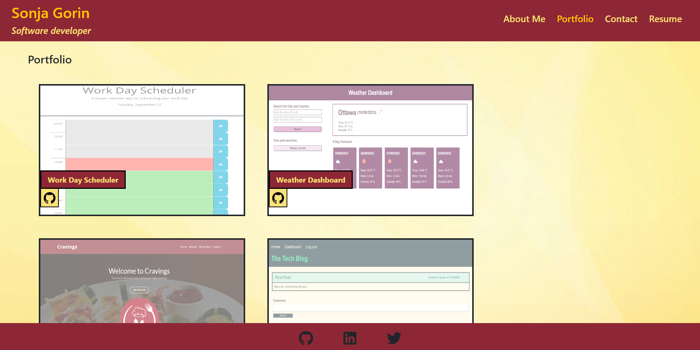
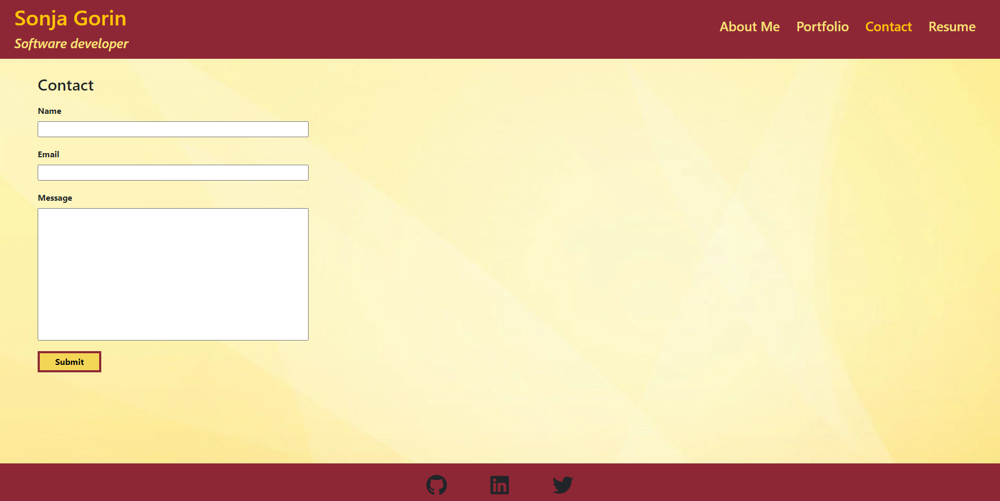
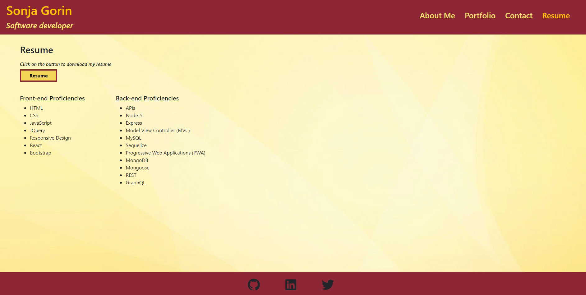

# React Portfolio

## Description
A compilation of academic and professional materials made with React.  

## Installation
To use the application first run "npm i".  
Then run "npm run dev".

## Usage
To view my Portfolio you can click on the link below.

[Portfolio - Sonja Gorin](https://65a07634d19fc7000914a732--exquisite-pie-cc33d5.netlify.app/)

Portfolio preview:

## License
Please refer to the LICENSE in the repo.
